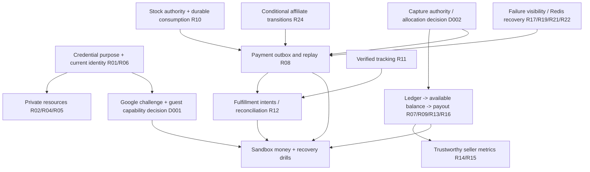

# Production hardening master plan

Date: 2026-10-02. Baseline: `57d8628768374c6be577a30e884bcd1a134cf833` plus existing uncommitted product/store-access work. No deployment, provider calls, data rewrites or commits authorized. Previous audit is a baseline, not certification.

## Discovery and revalidation

All six competitive-analysis documents read. Current code confirms a Nest modular monolith, Next admin/client, shared libraries, PostgreSQL financial/identity records, Mongo product details, Redis cache and BullMQ events. Nx resolved API targets: test, typecheck, lint, build. Local Node 24.14.0 is below repository minimum 24.15.0; record this rather than concealing it.

Critical traces:

- Client/admin credentials -> AuthController -> AuthService -> JWT/refresh cookie -> HTTP JwtStrategy and realtime validateSession -> role/permission guards -> private resources. Partial MFA tokens share access signing key; current central validator ignores purpose. Guest linking precedes mailbox verification.
- Cart/checkout -> server price/shipping calculation -> Order + StoreOrder + ledger transaction -> Stripe intent / PayPal capture -> payment DB transaction -> ORDER_PAID BullMQ fanout -> store confirmation, commissions, inventory, fulfillment, notifications. Manual order requests bypass capture and skip sale ledger. Online ledger is written too early. DB commit and queue publish are separate.
- Admin refund -> Stripe -> Payment + parent Order, but no proportional StoreOrder/ledger adjustment. Cancellation reverses ledger without a corresponding provider refund. Seller finance reads unallocated ledger; payout attaches entries, not provider settlement proof.
- Shipping webhook -> optional signature verification -> tracking lookup -> shop/parent transitions -> notification. Merchize create and push-to-production are separate external effects; retry after partial success can duplicate orders.
- Admin metrics -> shop-stats / product performance -> parent order totals or unit-price sums; some views/traffic are synthesized. Public search raw SQL manually copies only part of ORM filters.

### Revalidation register (before implementation)

All rows still exist in current source. Source paths below are under `apps/api/src/` unless stated. Test column describes baseline coverage, not tests passed this run. Runtime verification for every row is still required in isolated staging; no production data was inspected.

| ID | Root cause / exact source | Preconditions, blast radius, impact | Existing/missing tests; dependencies; schema/compatibility |
|---|---|---|---|
| R01 | auth/auth.service signPartialToken + confirmTotp; auth/validate-session ignores purpose | Password + pending MFA token can reach HTTP/socket resources and replace factor | auth-sessions lacks partial-token tests; add negative shared-validator and setup CAS tests. No schema/API shape change |
| R02 | auth/auth.service register/login linkGuestOrders and linkGuestConversations | Unverified claimed email exposes historical guest data | Add register/unverified login/verified linking tests. Future linking fixed without historical remap; old ownership review needs D001 |
| R03 | auth/auth.service buildGoogleAuthResponse always generates full session | Google sign-in bypasses local enabled MFA | Google response/UI challenge union is public contract decision D001; no silent new response shape |
| R04 | customization getDraftById unscoped; messages assertBuyerAccess accepts null/null | Knowledge of ID exposes drafts/guest threads | Draft owner/session/expiry tests; existing cookie usable without new contract. Guest capability requires D001 |
| R05 | reviews getProductReviews accepts query.status | Anonymous selection of hidden moderation statuses | Existing creation tests; add all-status public read tests. No migration; enforce existing public visibility intent |
| R06 | admin-team changes DB role; JWT returns stale role | Demoted privileged user retains old access claims | Shared validation rejects role mismatch across HTTP/socket. Session tests need current DB role. No schema |
| R07 | orders checkout ledger before capture; finances current sums ledger; store-orders requestPayout sums all unallocated entries | Online mode + unpaid checkout + payout request creates unsupported payable | Reversal tests do not prove capture eligibility. Payout semantics/historical balances D002 |
| R08 | payments onPaymentIntentSucceeded/onPayPal capture DB commit then publish; early PAID return | Queue loss/crash loses durable side effects | Need DB/outbox/queue crash injection. Depends on idempotent consumers R10/R24; additive schema proposed D003 |
| R09 | payments createRefund / onChargeRefunded vs orders cancellation | Paid/refunded/cancelled orders diverge from seller ledger; duplicate external calls | Partial multi-store allocation, provider idempotency and post-payout debt require D002/D003 |
| R10 | products/low-stock checkAfterOrder skips duplicate product lines and decrements without durable marker | Duplicate paid event, concurrent purchases, variant quantities | Missing DB concurrency/reservation tests. Requires stock authority/reservation and historical activation choice D003 |
| R11 | shipping/tracking-webhook allows missing secret | Anonymous tracking payload can mutate shipping state | Fail-closed, missing/malformed signature/raw body tests. No schema; configuration now required for mutation |
| R12 | orders cancel rejects manual CONFIRMED; digital parent/child drift; Merchize push failure swallowed | Manual cancel or digital pay or partially accepted fulfillment | Existing lifecycle tests incomplete. Provider intent/reconciliation D003; cannot safely solve by blind retry |
| R13 | schema Order has archive fields but no explicit test provenance | Test orders enter real metrics/finance | Hard-delete/reversal tests exist. No financial record deletion; classification/backfill D002 |
| R14 | products getPerformance Math.random, estimated views, fixed sources | Seller metrics show fabricated trend | Need nullable/unavailable metric contract + UI D004; never replace with fabricated zeros |
| R15 | shop-stats parent total per shop; listing aggregate sums unitPrice without quantity | Multi-store or quantity >1 inflates/understates reports | Add quantity regression where safe; scope/revenue definitions depend D002/D004 |
| R16 | marketing controller + client tracker attribute general referrer as OFFSITE_AD | Ordinary inbound referral can incur fee | Campaign proof + fee change D002; do not silently change economic policy |
| R17 | text/image moderation errors return CLEAN; budgets return successful no-op | Provider outage/oversize/budget exhaustion approves or strands content | Failure injection + invalid provider-output tests; pending/retry semantics, no CLEAN cache on failure. No schema for fail-closed path |
| R18 | search fullTextSearch copies incomplete where; category descendant predicate omitted | Text search plus advanced filter gives mismatched results/counts | Safe ORM fallback for filters not expressible by existing SQL; test parity of page/count predicates; no API change |
| R19 | image.processor background failure returns original; generic preview demo-only | Missing provider key/outage falsely reports success | Make existing failed job state truthful; tests no output upload on failures. General renderer remains missing, not a bug-sized fix |
| R20 | health storage hardcoded ok; deployment accepts HTTP200 degraded | DB/Redis/storage outage missed by deploy readiness | Need dependency probes/bounded timeouts and deployment body validation; no live deploy. API status contract D004 |
| R21 | common/services/redis retryStrategy null, KEYS invalidation, security counters fail open | Redis restart disables cache until restart; unavailable login counters bypass lockout | Reconnect + SCAN tests safe. Security store separation/fail-closed login requires availability policy D001 |
| R22 | queue/dead-job-alert serializes payload and error text; alert uses same Redis | Terminal failures leak PII/secrets; Redis outage also loses email alert | Redaction test; out-of-band alert + replay/reconciliation runbook requires sandbox verification |
| R23 | marketing/social DB toggles only; newsletter welcome email no subscription persistence | UI implied capability exceeds implementation | Existing social scope explicitly UI-only; no claim of real publication. Product/API/provider scope D004 |
| R24 | affiliate confirm/cancel/request/reject read outside transaction then unconditional mutation | Concurrent retries double credit/debit/refund; payout marks every commission paid | Add conditional transitions/transaction tests; allocation semantics D002. New finding: rejectPayout race can re-credit twice |

## Priority model

Order by (1) unauthorized access or creation/loss of money, (2) prerequisites and reachability, (3) irreversibility, (4) ability to enforce an invariant with negative tests, (5) compatibility/migration risk. Availability and truthful metrics follow. R24 conditional money transitions promoted above cosmetic analytics; R08 cannot be independently declared fixed before safe replay of R10/R24. Paid pilot stays blocked by economic invariants regardless of number of tickets closed.

## Dependency Graph

## Phase design

### A — Establish access boundaries

Objective: reject partial credentials, stale roles and unauthorized private reads; link guest history only after mailbox proof. Why now: internet-reachable prerequisites to all downstream trust. Issues R01/R02/R04/R05/R06; Google/guest capability branch R03 gated D001. Dependencies: discovery/self-review. Files: auth service/validator/strategy, customization controller/service, reviews service, realtime tests. Approach: central purpose/role rejection, conditional MFA setup, verified-only linking, scoped draft reads using existing identity/cookie, fixed public review visibility. Schema: none. Compatibility: retain legitimate legacy access JWT without purpose; invalid partial JWT is not a supported access credential. Tests: cross-account, partial token HTTP/socket, role changes, expired guest draft, concurrent factor setup. Acceptance: negative tests and existing sessions/reviews pass; R03 and historical ownership are not hidden by this phase. Rollback: revert individual patch only; do not restore known bypass on an exposed system. Unknown: historical mislinks and external clients relying on insecure paths.

### B — Make failures truthful and recoverable

Objective: unauthenticated provider events cannot mutate state; failed moderation/image operations cannot claim success; dead-job reports contain no raw payload. Why now: bounded local fixes with low data risk, prerequisite to retry. Issues R11/R17/R19/R21/R22. Depends A for trust, can be tested independently. Files shipping webhook, moderation services, image processor, Redis service, dead-job-alert. Approach fail-closed missing config/signature; throw sanitized worker failures; validate model output; bounded reconnect, incremental SCAN. Schema none; preserve existing success/failure response shapes. Tests failure injection and redaction, Redis transient recovery mock. Acceptance no DB/event/output mutation on verification/provider failure; no CLEAN verdict on unknown results. Rollback per component; never replay jobs until consumer invariants established. Unknowns external HMAC format, queue outage operational alerting, oversize/manual review and exhausted-budget recovery.

### C — Conditional financial transitions, not new payout policy

Objective prevent duplicate affiliate credit/debit under competing operations. Why now money correctness; only existing state-transition semantics, no rate/allocation change. Issues R24. Depends verified identity; requires no R07 seller policy change. Files affiliate commission/portal/admin service + tests. Approach transaction + conditional update with exact expected state; reserve sufficient active-account balance atomically before payout creation; reject race causes retry, not silent lost reversal. Schema none. Compatibility same DTOs and amount semantics; concurrent losers get existing error class. Tests duplicate confirmation/cancel/rejection, insufficient balance race, transaction rollback modeled and real DB drill still required. Acceptance one committed economic effect per transition, no double reversal. Rollback code only, do not reverse legitimate balances; historical anomalies need D002. Unknown allocation and settled commission treatment remains blocked.

### D — Query integrity and operational evidence

Objective preserve search constraints, establish honest readiness/recovery record. Why after security/money containment: lower severity and dependent metrics. Issues R18; R14/R15/R20/R23 gated scope; R12/R13 remain explicitly tracked. Files search service/tests, hardening runbooks/re-audit. Approach retain raw FTS only for predicates it supports; use shared existing ORM fallback otherwise; don't invent metric data. Schema none. Compatibility response unchanged; advanced filtered searches use ILIKE matching/sort rather than FTS rank until unified query implementation. Tests page/count share full predicate, no filtered/deleted leaks, all relevant regression/typecheck/lint. Acceptance evidence-backed statuses and explicit remaining failures. Rollback search patch only. Unknown runtime large dataset latency, real provider reconciliation.

### E — Economic/state-machine redesign behind owner decisions

**2026-10-03 superseding status:** D001–D004 options A and the detailed five-action plan are approved. The paragraph below preserves the original decision-gated design, not a current request for reapproval. M1 policy/conservation and dormant M2 foundations are implemented locally; coordinated M3 capture/balance/payout and M4 refund/recovery activation remain open. See `economic-policy-v1.md` and `progress.md` for the precise implemented boundary and evidence. No financial historical backfill is authorized.

Objective money flow reconcile end-to-end and recover across provider/DB/queue boundaries. Issues R03/R04 guest, R07–R10/R12–R16/R20/R23 plus remaining R24. Why gated: public contract, fee and payout semantics/historical records cannot be decided implicitly. Dependencies D001–D004 and A–D. Files auth clients/contracts, orders/payments/ledger/payout/inventory/fulfillment + additive schema. Proposed approach durable operation intents, transactional outbox, deduplicated consumers, scoped per-shop adjustments, immutable payout allocation and reconciliation exceptions. Schema proposed only; no migration applied. Compatibility expand/backfill/dual read/activate after approved cutoff; never retroactively replay historical paid orders. Tests sandbox provider timeout/duplicate webhook, DB/Redis failure at each boundary, real PG concurrent final-unit inventory, partial multi-store refund and post-payout recovery. Acceptance reconciled provider totals, seller allocations and stock plus audited recovery drill. Rollback stop dispatch and disable economic write features, retain intents/history, no reverse destructive migration. Unknown real provider states, historical debt and order provenance. Execution blocked pending decisions; continue safe phases.

## Plan self-review gate — completed before implementation

### M1/M2 follow-up self-review — 2026-10-03

- Moving available-balance logic before verified capture allocation still risks stranded or invented money; no existing finance reader/producer is switched in this foundation milestone.
- Intents now persist provider/account/mode/request fingerprint, and ambiguous dispatches cannot return to PREPARED. Verified evidence adapters and monetary allocation writes must land together before any SUCCEEDED operation producer is exposed.
- Outbox alone is insufficient: bounded fenced leases, final-attempt dead-letter handling and transactional receipt/effect primitives are present, but no dispatcher routes historical events into old consumers.
- Inventory release must use the original pool even after catalog edits. Grouped snapshot reservations now encode this; missing/null original pools require reconciliation, and late capture fails closed pending M4 reacquisition.
- Prisma validates shapes, not custom SQL triggers or real PostgreSQL contention. SQL checks/immutability guards need isolated DB execution, still unperformed. Sandbox/provider and production rollout gates remain separate.

### Original review

Found and incorporated:

1. Outbox alone would replay non-idempotent stock and affiliate consumers. Therefore E is downstream of durable consumption and C; no blanket payment replay.
2. Moving guest linking out of registration alone is insufficient: unverified password login also links. Gate both, link after verifyEmail and verified Google, never reassign already owned records.
3. Checking totpEnabled then updating is racy. Use conditional database mutation; backup-code consumption must also compare original array.
4. Role revocation only in admin-team misses other role mutations. Shared validator must compare database role on HTTP and realtime; refresh reads current role.
5. Guest draft cookie must not authorize a signed-in owner's draft. Anonymous predicate includes userId:null; logged-in caller uses only their user ID.
6. Throwing after Merchize create without durable external ID duplicates orders. Do not apply that naive fix; operation intent/reconciliation design remains gated.
7. Cancellation and commission confirmation can race. Re-read inside transaction or compare exact old state; conflict must retry rather than silently swallow reversal.
8. Alert error messages themselves may contain credentials; removing only job.data is insufficient. Use fixed error category, correlation via job ID.
9. Historical data, Google challenge contract, fee provenance, payout allocation and real provider operations remain decision gates. A fully implemented A–D does NOT establish readiness for paid pilot.

Implementation may now start. Record measured test evidence and scope adjustments in progress.md; never mark whole subsystem verified from mocked unit tests alone.

## Implementation review updates

- 2026-10-04 M3a: implemented a prospective quote + read-only provider evidence + atomic capture/part allocation/journal/Payment/outbox boundary, still unregistered. JSONB key order must not alter fingerprints; signed integer money must reconcile by account AND beneficiary, not total alone. Added SQL canonical-journal checks to reject VAT-to-revenue, wrong affiliate and offsetting bogus rows. Recheck method/currency after provider I/O before booking. Full API regression 55 suites/540 tests passes; one Jest wrapper executes 11 real isolated PostgreSQL cases. No multi-session, provider sandbox or active checkout/payout claim.
- M3a integration findings: mixed/gift-card residual tender (including existing small-remainder forgiveness), gift-wrap per-shop attribution and share-save beneficiary must be explicit; fail closed in the new producer pending integration, not silently omit funding. VAT liability is separate from platform fee revenue; expected shipping subsidy is not actual spend or seller credit. Unsupported offsite fees require verified campaign evidence. Balance/payout must migrate together with producers and consumers; existing legacy paths remain unchanged.

- 2026-10-03 E3a review before edits (D004/R20, independent of economic policy): preserve diagnostic `/health` but add truthful statuses/provenance, separate process liveness from `/health/ready`; readiness returns 503 on any required dependency failure, timeout or missing storage configuration. Probe PostgreSQL SELECT 1, Redis PING, Mongo ping and read-only S3 HeadBucket, with bounded HTTP waiting and coalesced per-dependency calls (never unbounded repeated hung probes). Storage probe uses AbortSignal. Update deployment/Docker checks to readiness; no script execution/deployment. Tests inject failure/timeouts/unconfigured storage and verify status contract and integration paths. Bucket-read permission is not upload/SMTP/payment readiness; explicitly publish probe scope. No schema or historical changes. Money policy remains D002 and is not silently altered by this operational subphase.

- E2 guest messaging design review before edits: add GuestMessageAccess (12-character ID, salted verification-code hash, random access-token hash, expiry, verification timestamp, attempt budget, revocation). Email proof grants only anonymous conversations for that mailbox, never an account-owned thread or account/session privileges. Existing IDs/emails no longer authorize reads or mutations. Verify by conditional mutation with five attempts and bounded TTL; new proof required for recovery. Strict Redis limits proof-email requests. HttpOnly same-site cookie + origin protection for cookie-authorized routes; schema expansion required before API activation. Order association also needs actual buyer/mailbox ownership. No existing ownership backfill or email dispatch during local tests. Cover read/write/page/upload/preview/hide/report, wrong/expired/replayed proof, queue failure and cross-account cases. Real DB/SMTP and cookie verification remain staging requirements.

- 2026-10-02 owner approved recommended options A in D001–D004. Phase E repository work is now authorized; prior "blocked pending decisions" language records the initial gate, not a continuing implementation block. Production activation, credentials, historical corrections and live money remain excluded.
- E1 identity subphase: atomic refresh consumption + successor transaction; strict atomic-expiry Redis security counters; role-independent Google/password MFA challenge union; one-use challenge and account attempt budget; coordinated storefront MFA and server-validated session bridge. No schema change. Validate unit failures, API/admin/client typechecks, browser desktop/mobile mocks; real PG/Redis/Google verification remains distinct.
- N26 discovered while tracing Google consumers: storefront `google-token` NextAuth provider trusted browser-supplied identity JSON. It must derive identity from a protected, uncached `/users/me` request with the submitted bearer token; reject errors or partial credentials. Test forged role/ID and API failure. The existing signed session alone is not API authorization.
- Refresh CAS requires coordinated request retry behavior. Shared browser API wrappers now coalesce refresh calls and never auto-refresh/retry password, Google or MFA verification failures. Do not claim cross-tab coordination or Redis restart replay protection from these changes.

- N25: `verifyEmail(@Body('token'))` has no DTO validation; undefined removes Prisma's token predicate. Added explicit runtime nonempty-string validation before DB access and six malformed-input tests. This is an identity invariant blocker discovered while tracing the revised verification/linking boundary, not a new public contract.
- R11: official EasyPost v1 uses `hmac-sha256-hex=` prefix (see recovery runbook sources). Accept documented prefix plus existing bare digest, both checked in constant time. Do not claim v2 timestamp/replay or lifecycle correctness.
- R24: preserve PROCESSING as well as REQUESTED when marking/rejecting an affiliate payout; guard exact observed state so concurrent terminal actions cannot both win.
- R22: expanded safe patch to central HTTP logger: route template + correlation/status, without URL/query, IP/user-agent or exception body.
- R15: corrected quantity arithmetic only (historical price groups and daily sum reuse). No seller balance, fee formula or historical record reinterpretation changed; shop-parent allocation and synthetic views stay open.
